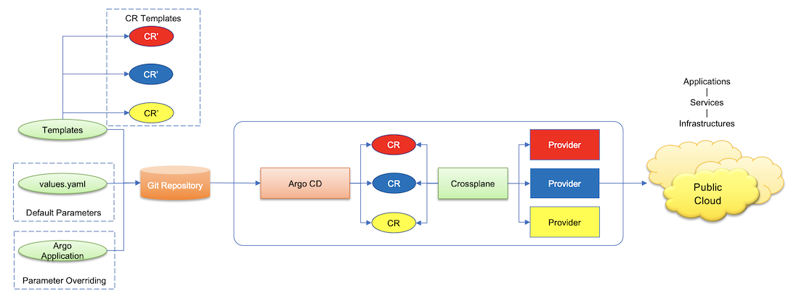
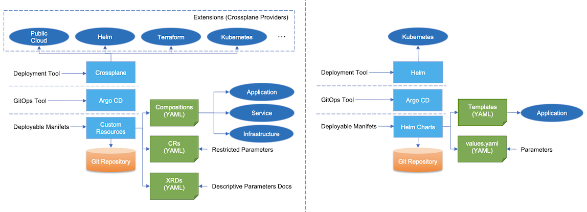

<!-- START doctoc generated TOC please keep comment here to allow auto update -->
<!-- DON'T EDIT THIS SECTION, INSTEAD RE-RUN doctoc TO UPDATE -->
**Table of Contents**  *generated with [DocToc](https://github.com/thlorenz/doctoc)*

- [Using Crossplane in GitOps, Part II](#using-crossplane-in-gitops-part-ii)
  - [Store Manifests in Git Repository](#store-manifests-in-git-repository)
    - [Managed Resources](#managed-resources)
      - [Using Kustomize](#using-kustomize)
    - [Managed Resources As Template](#managed-resources-as-template)
    - [Composition and CompositeResourceDefinition](#composition-and-compositeresourcedefinition)
      - [When to Check Composition and CompositeResourceDefinition in Git](#when-to-check-composition-and-compositeresourcedefinition-in-git)
      - [Using Kustomize](#using-kustomize-1)
  - [Crossplane vs. Helm](#crossplane-vs-helm)
    - [Crossplane Composition vs. Helm Templates](#crossplane-composition-vs-helm-templates)
    - [CompositeResource(Claim), CompositeResourceDefinition vs. values.yaml](#compositeresourceclaim-compositeresourcedefinition-vs-valuesyaml)

<!-- END doctoc generated TOC please keep comment here to allow auto update -->

# Using Crossplane in GitOps, Part II 

In this article, I will share my recent study on Crossplane use in GitOps. I will use Argo CD as the GitOps tool to demonstrate how Crossplane can work with it to provision applications from git to target cluster. Meanwhile, I will also explore some best practices, common considerations, and lessons learned that you might experience as well when use Crossplane in GitOps.

## Store Manifests in Git Repository

Now that you have launched the environment with the prerequisites ready including Crossplane, its providers, and all the necessary configuration, you can start to check application manifests in git to trigger the application provisioning driven by GitOps. There are several ways that we can consider.

### Managed Resources

In Crossplane, managed resource is Kubernetes custom resource defined and handled by Crossplane Provider. You can think of Crossplane with its provider equivalent to Kubernetes controller or operator. As such, when you check managed resource as manifest in git, it will be synchronized by Argo CD from git to target cluster, then detected by the provider and drive the actual application provisioning.


For example, check below managed resource in git, you will be able to deploy an Elasticsearch instance with the help of provider kubernetes:

```yaml
---
apiVersion: kubernetes.crossplane.io/v1alpha1
kind: Object
metadata:
  name: elasticsearch-my-logging-stack
spec:
  references:
  - fromObject:
      apiVersion: kubernetes.crossplane.io/v1alpha1
      kind: Object
      name: csv-my-logging-stack
      fieldPath: status.atProvider.manifest.status.phase
  forProvider:
    manifest:
      apiVersion: elasticsearch.k8s.elastic.co/v1
      kind: Elasticsearch
      metadata:
        name: my-logging-stack
        namespace: default
      spec:
        version: 7.13.3
        nodeSets:
        - name: default
          count: 1
          config:
            node.store.allow_mmap: false
  providerConfigRef:
    name: provider-config-dev
```

This approach is very straightforward, but it does not allow you to customize the configuration. For example, in our case, if you want to deploy Elasticsearch using another version instead of the one defined in the above managed resource, you need a way to override the default configuration.

Another example is the per-environment deployment. When you deploy application to multiple clusters where some clusters may have specific configuration than others, you may need per-environment configuration. Of course, if you have one folder for each environment in git, you can copy and paste all the manifests to each folder that maps to the specific environment and do the environment specific modifications there. This may lead to duplication that is hard to maintain when the repository grows.

#### Using Kustomize

Per environment configuration can be done by [Kustomize](https://kustomize.io/). By using Kustomize, you can have the manifests with their default configuration at `base` layer, then specify the custom settings at `overlays` layer to override the base one.

However, it should not be overused too much. The reason is that it obfuscates the understanding of what is actually deployed. If there are many kustomize-based versions of the same application manifests for different clusters, you have to assemble the final YAML in your head or using `kustomize` CLI to understand what is actually deployed in each cluster. In such a case, a templated framework like Helm would help.

### Managed Resources As Template

Helm dynamically generates the configuration based on functions and parameters. It results in more reusable manifests stored in git. By using Helm, you can extract customizable configuration out of the managed resources, and put them into `values.yaml` with default values provided. With that, the managed resources stored in git will be templated manifests.



The good news is that Argo CD supports Helm very well. You can override the configuration defined in `values.yaml` when you define Argo `Application` resource for your application to be deployed. As an example, in the below Argo `Application`, we customized the name of the capabilities to be deployed via `spec.source.helm.parameters`.

```yaml
apiVersion: argoproj.io/v1alpha1
kind: Application
metadata:
  name: capabilities-logging-app
  namespace: argocd
spec:
  destination:
    namespace: dev
    server: 'https://kubernetes.default.svc'
  source:
    path: config/capabilities/crossplane-helm/logging
    repoURL: 'https://github.com/morningspace/capabilities-shim-gitops'
    targetRevision: HEAD
    helm:
      parameters:
        - name: metadata.name
          value: dev-env-logging-stack
  project: default
```

You can even override the configuration via Argo CD UI when you create or update the Argo `Application`.


### Composition and CompositeResourceDefinition

Crossplane has a powerful composition engine. By defining `Composition` resource, it can compose multiple resources at different level from infrastructure to application all driven by providers at backend from different vendors.

It also supports `CompositeResourceDefinition` (XRD) resource, which is extracted from the resources to be composed, and exposed as configurable settings with well-defined type and schema.

Both `Composition` and `CompositeResourceDefinition` resources can be checked into git, so they can be synchronized by GitOps tool from git to target cluster. Based on that, you can define `CompositeResource` (XR) or `CompositeResourceClaim` (XRC), which is usually environment specific, and check it in git as well. After it is synchronized from git to target cluster, it will trigger Crossplane to generate the corresponding managed resources which will be detected by the providers and drive the actual application provisioning.


In our case, since we have already synchronized and installed the Crossplane configuration package which includes all `Composition` and `CompositeResourceDefinition` resources to the target cluster by checking the `configurations.pkg.crossplane.io` resource in git, you do not have to check these packaged resources in git any more. The only thing you need to check in git is the `CompositeResourceClaim` resource such as below:

```yaml
apiVersion: capabilities.morningspace.io/v1alpha1
kind: LoggingClaim
metadata:
  name: my-logging-stack
spec:
  parameters:
    esVersion: 7.13.3
    kibanaVersion: 7.13.3
  compositionSelector:
    matchLabels:
      capability: logging
      provider: olm
```

#### When to Check Composition and CompositeResourceDefinition in Git

It depends on whether or not you want to expose these details to Ops or SREs. For example, if you want them to understand how the manged resources are organized, to be able to modify these compositions, or even define their own compositions as needed, then you should check Composition and CompositeResourceDefinition in git.

#### Using Kustomize

The `CompositeResourceClaim` resource is usually environment specific. That means you can put it into environment specific folder in git. However, if you want the resource to be reusable and only override it partially per environment, you can also use Kustomize. Below is a sample folder structure:

```
└── environments
    ├── base
    │   ├── logging-claim.yaml
    │   └── kustomization.yaml
    └── overlays
        └── dev
            ├── logging-claim.yaml
            └── kustomization.yaml
```

There is a `logging-claim.yaml` in `base` folder, and a customized version in `overlays/dev` folder to override the base for environment dev.

```yaml
apiVersion: capabilities.morningspace.io/v1alpha1
kind: LoggingClaim
metadata:
  annotations:
    capabilities.morningspace.io/provider-config: provider-config-dev
  name: my-logging-stack
spec:
  parameters:
    esVersion: 7.15.0
    kibanaVersion: 7.15.0
```

Here we changed the version of Elasticsearch and Kibana to 7.15.0 as opposed to the default value in base, 7.13.3. We also added the annotation to specify which ProviderConfig we are going to use.

## Crossplane vs. Helm

When use Composition, you may notice that it is very similar to Helm templates since essentially they both compose a set of Kubernetes resources. From application deployment point of view, Crossplane, as a deployment tool, provides some building blocks that are very similar to what Helm does, but they also have differences. In this section, I will explore them and make side-by-side comparison between Crossplane and Helm.

Before that, there is one thing you may need to know: Crossplane and Helm are not mutual exclusive. Instead, they can be combined together. For example, you have already seen that Crossplane managed resources can be made as template using Helm. Especially, when you only use Crossplane providers and do not use its comopsition feature, the Crossplane runtime with the provider is very similar to a Kubernetes controller or an operator. In such a case, using Helm to render Kubernetes resources managed by the controller or operator is a very common practice.

### Crossplane Composition vs. Helm Templates

A Crossplane `Composition` resource defines way of composing a set of Kubernetes resources. It is equivalent to Helm templates which include a set of template files and each file maps to one or more Kubernetes resources. A Crossplane Configuration package typically includes a set of Compositions, which map to multiple charts or sub-charts in Helm. The difference is that Composition organizes resources in a monolithic way where all resources are defined in the same file. But for Helm templates, they are separate files in the same folder or different folders. Certainly you can combine these files together as a single file to make it very similar to a Crossplane Compsotion resource, but they do have some differences in nature as below:

* Instead of templating, Crossplane renders `Composition` resource by extracting values from `CompositeResource` (XR) or `CompositeResourceClaim` (XRC) resource and patching them to specific fields on managed resources. This is very similar to Kustomize.
* At a much higher level, we usually see Crossplane Composition is used to composing modules from infrastructure, service, to application in more coarse grained way. On the other hand, Helm usually focuses on "composing" modules at application level in more fine grained way. But this does not mean you cannot compose infrastructure using Helm. For example, with the combined use of Crossplane Provider and Helm, you can compose infrastructure, service, and application too.

### CompositeResource(Claim), CompositeResourceDefinition vs. values.yaml

The Crossplane `CompositeResource` (XR) or `CompositeResourceClaim` (XRC) resource is essentially equivalent to the `values.yaml` file in Helm. Just like `values.yaml`, XR/XRC is aimed to extract the configurable settings out of the original resources for people to consume.

As an example, in our demo project, there is also a folder including all manifests used to provision the demo application using Helm. If you look at the `values.yaml` inside the folder, you will see it is very similar to the `CompositeResourceClaim` resource that we defined previously:

```yaml
metadata:
  name: my-logging-stack
  namespace: default
spec:
  parameters:
    esVersion: 7.13.3
    kibanaVersion: 7.13.3
```

The major difference between the two representations is that, Crossplane uses a more well-defined data structure to organize these configurable settings. That is `CompositeResourceDefinition` (XRD). By defining XRD, you can restrict user input with these settings in a more controlled manner. For example, each field has a type and can be required or optional. All user input verification happens at server side. This is very different from what Helm does. Also, each field can have a description so that the field can be well documented and self explained.

Another apparent difference is that, GitOps tool such as Argo CD has integrated with Helm very well. You can specify custom settings in Argo `Application` resource, even from its UI, without touching `values.yaml` directly. Crossplane on the other side has no such level of integration yet.

Below is a table that summarizes all above differences that we explored.

| Crossplane                  | Helm        | Description
|:----------------------------|:------------|:-----
| Composition                 | Templates   | Both to compose a set of Kubernetes resources, but Composition uses patch to override while Helm uses template.
| CompositeResource(Claim)    | values.yaml | Both to allow user input as configurable settings. Argo CD has better support on Helm, e.g: to specify values in Argo `Application` resource.
| CompositeResourceDefinition | n/a         | CompositeResourceDefinition as a schema has better user input control.

And a diagram to depict the side-by-side comparison results.



In next article, I will explore some common considerations when you practice Crossplane in GitOps such as synchronization order, hooks, health check, git repository folder structure, and so on.

*(To be continued)*